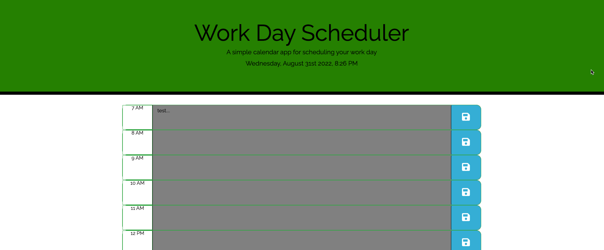
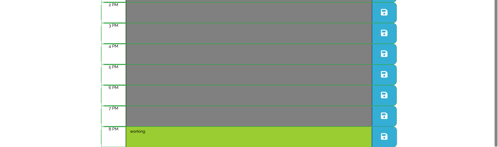

# Scheduler 📅

## Description

As a coding boot camp student, I have created a simple calendar application that allows a user to save events for each hour of the day. 
This app will run in the browser and feature dynamically updated HTML and CSS powered by jQuery.

The Scheduler 📅 will be able to:

    -- Add important events to scheduler
    -- Current date and time is shown when scheduler is loaded
    -- Work Hours are displayed for a 12 hour shift
    -- Time block are displayed and color coded for past, present, and future.
    -- When a user clicks on a time block, user is able to enter text.
    -- When user clicks on save icon, event entered is saved to local storage.
    -- When page is refreshed, saved events persists. 

## Table of Contents 

- [Mock-Up](#mock-up)
- [Credits](#credits)

## Mock-Up

Below is a mock-up 

## Credits ©

-Google
-Bootstrap
-JQuery
-Moment
-Font Awesome
-YouTube

## URL

🟢 CLICK HERE &#10145;    https://lflyew.github.io/WorkDay/

## Author

[@LatoyaLyew] (https://github.com/lflyew) ❤️

🏆 